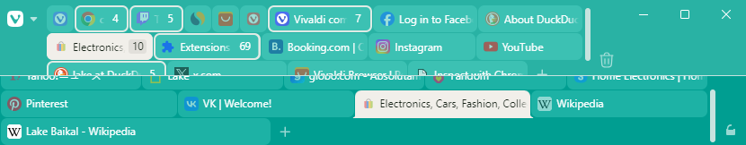

# Vivaldi CSS modifications

## How to install
- Install [Vivaldi](https://vivaldi.com)
- Download CSS file to a folder
- Open [vivaldi://experiments](vivaldi://experiments)
- Enable 'Allow CSS modifications'
- Open Vivaldi Settings / Appearance
- Under 'Custom UI Modifications' choose the folder with the saved file
- Restart Vivaldi

## Multi Row Tabs and more: [multi-row-tabs-v2.css](https://raw.githubusercontent.com/hababr/vivaldi-css/refs/heads/main/multi-row-tabs-v2.css)

Allows to split tabs into multiple rows. Configuration is available at the beginning of the file.
### Features:
- Multi row tabs at the top and bottom, stacked tabs included
- Minimum and maximum width can be configured separately for: tabs, tabs in stack, pinned tabs, pinned stacks
- Row count can be limited and scrollbars can be enabled
- The full width of the window can be used

Scrollbars:\

Full window width:\

